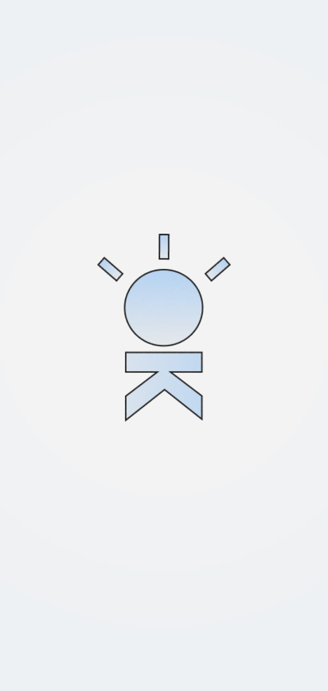
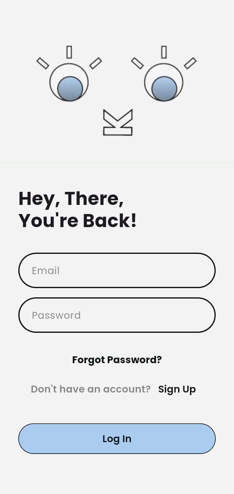
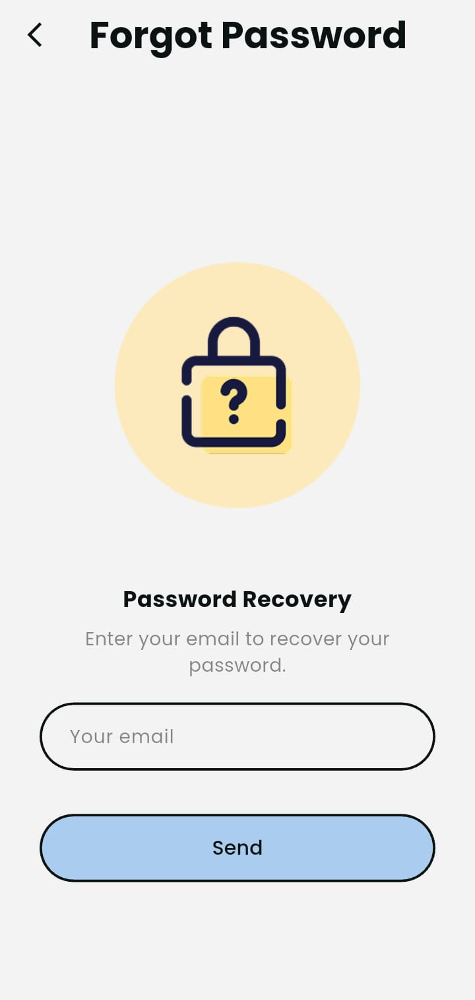
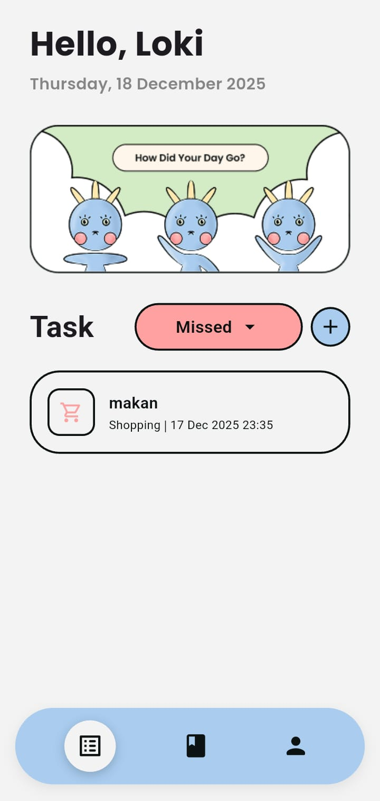
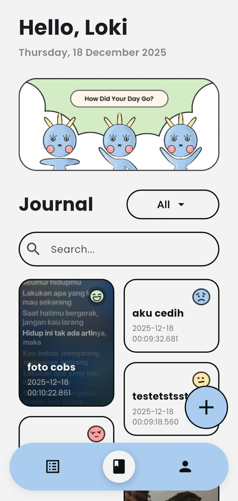
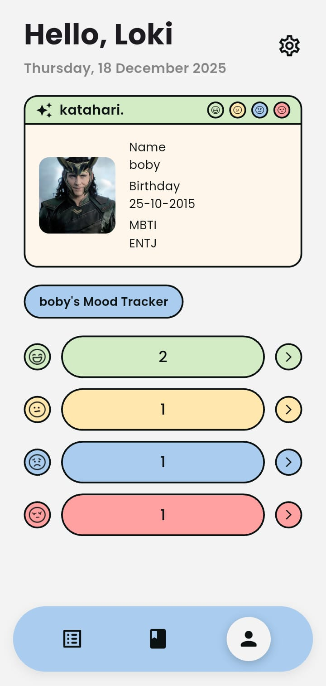
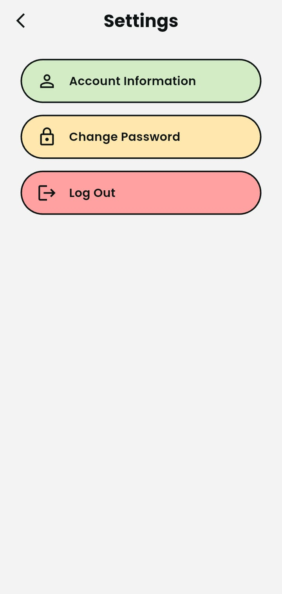

# Katahari
Katahari is a mobile application that combines a **To-Do List** and an **Aesthetic Journal** to help users manage daily activities while expressing their thoughts and emotions creatively. The application is developed using **Flutter** and **Dart**.

---

## Student Informations

| Information | Details                        |
|-------------|--------------------------------|
| **Name**    | Alissya Humairah Martiasaputri |
| **ID**      | 231401039                      |
| **Class**   | C                              |
| **Name**    | Chairun Nisaq                  |
| **ID**      | 231401042                      |
| **Class**   | C                              |
| **Name**    | Rima Maharani Lubis            |
| **ID**      | 231401015                      |
| **Class**   | C                              |

---

## Project Description
**Katahari** is a mobile application designed to support both productivity and self-expression. The application provides a **to-do list** feature for managing daily tasks and an **aesthetic journal** feature that allows users to write daily entries enriched with stickers, photos, and other visual elements. Additionally, Katahari includes a **User ID Card** feature that displays user identity within the application.

### Key Features
- **To-Do List**  
  Create, edit, delete, and mark daily tasks as completed.
- **Aesthetic Journal**  
  Write daily journals with support for stickers, photos, and creative visual layouts.
- **User ID Card**  
  Displays user identity in a digital card format.
- **Setting**
  Allows users to customize application preferences such as account settings, password, and logout.
- **Mood Statistic**
  Displays visual summaries of users’ mood data over time to help track emotional patterns and support self-reflection.

---

## Screenshots

| Splash Screen                                      | First Page                             v   | Sign In Screen                              |
|----------------------------------------------------|--------------------------------------------|---------------------------------------------|
|  |  |  |
| Displays the app logo while loading.               | Main page to access core features.         | Allows users to log in securely.            |

| Sign Up Screen                                |  Forgot Password                            | To-Do Screen                                 |
|-----------------------------------------------|---------------------------------------------|----------------------------------------------|
|  | |    |
| Enables new users to create an account.       | Helps users reset their password.           | Manages daily tasks efficiently.             |

|  Journal Screen                              | Profile Screen                                | Settings Screen                               |
|----------------------------------------------|-----------------------------------------------|-----------------------------------------------|
|  |  |  |
| Records daily reflections and moods.         | Displays user account information.            | Customizes app preferences and settings.      |


---

## Project Structure

```text
lib/
├── main.dart                         # The main entry point of the Flutter application.
├── wrapper.dart                      # Handles authentication flow and determines the initial navigation of the application.
├── firebase_options.dart             # Contains Firebase configuration settings generated for the application.
├── components/                       # Reusable UI components
│   ├── all/                         
│   │   └── header_widget.dart        # Custom header widget used in several screens.
│   ├── journal/                      # UI components related to the journal feature, such as dropdowns, journal cards, and grid layouts.
│   │   ├── dropdown.dart             
│   │   ├── how_was_your_day_card.dart
│   │   ├── journal_card.dart
│   │   └── journal_grid.dart
│   ├── todo/                         # UI Components for Todo Pages
│   │   ├── custom_date_time_picker.dart
│   │   └── empty_state.dart
│   └── bottom_navigation_shell.dart  # Bottom navigation bar used for navigating
│
├── config/                           # App configuration
│   └── routes.dart                   # Application routes
│
├── constant/                         # Constants
│   └── app_colors.dart               # Stores color constants to maintain consistent styling across the application.
│
├── models/                           # Data models
│   └── todo_model.dart               # Data model representing a to-do item.
│
├── pages/                            # Application pages (screens)
│   ├── forgotpass/                   # Screens related to password recovery.
│   │   └── forgot_page.dart
│   │
│   ├── journal/                      # Screens for adding, viewing, and managing journal entries.
│   │   ├── add_journal_page.dart
│   │   ├── journal_detail_page.dart
│   │   └── journal_page.dart
│   │
│   ├── profile/                      # Screens for user profile management and mood journaling.
│   │   ├── edit_profile_page.dart
│   │   ├── journal_mood_page.dart
│   │   └── profile_page.dart
│   │
│   ├── registrasi/                   # Authentication screens including onboarding, login, and signup.
│   │   ├── first_page.dart
│   │   ├── login_page.dart
│   │   ├── signup_page.dart
│   │   └── splashscreen.dart
│   │
│   ├── settings/                     # Screens for account settings and password management.
│   │   ├── account_information_page.dart
│   │   ├── change_password_page.dart
│   │   └── settings_page.dart
│   │
│   ├── todo/                         # Screens for creating, editing, and displaying to-do items.
│   │   ├── create_todo_page.dart
│   │   ├── edit_todo_page.dart
│   │   └── todo_page.dart
│   │
├── services/                         # Application services
│   └── todo_services.dart            # Handles business logic and data operations related to to-do items.
│   │
├── utils/                            # Utility class for formatting date and time values consistently across the application.
│   └── date_formatter.dart
```

---

### **Services**
- Firebase Authentication
- Cloud Firestore
- Flutter Framework
- Supabase

---

## Packages & Dependencies
| Package                     | Version  | Purpose                                             |
| --------------------------- | -------- | --------------------------------------------------- |
| flutter                     | SDK      | Main framework used to build the mobile application |
| cupertino_icons             | ^1.0.8   | Provides iOS-style icons                            |
| firebase_core               | ^4.2.0   | Initializes and connects the app to Firebase        |
| firebase_auth               | ^6.1.1   | Handles user authentication                         |
| cloud_firestore             | ^6.0.3   | Cloud database for storing application data         |
| go_router                   | ^16.2.5  | Manages navigation and routing                      |
| get                         | ^4.7.2   | State management and utility functions              |
| google_fonts                | ^6.3.2   | Enables custom fonts from Google Fonts              |
| flutter_svg                 | ^2.2.1   | Renders SVG images                                  |
| font_awesome_flutter        | ^10.12.0 | Provides Font Awesome icons                         |
| flutter_gif                 | ^0.0.4   | Displays GIF animations                             |
| video_player                | ^2.10.0  | Enables video playback                              |
| intl                        | ^0.20.2  | Supports date and time formatting                   |
| dropdown_button2            | ^2.3.9   | Customizable dropdown widgets                       |
| image_picker                | ^1.1.2   | Allows image selection from gallery or camera       |
| supabase_flutter            | ^2.10.3  | Integrates Supabase backend services                |
| flutter_staggered_grid_view | ^0.7.0   | Creates staggered grid layouts                      |
| device_preview              | ^1.1.1   | Previews UI on multiple device sizes                |

---

## How to Install the Application

1. Open the **Releases** page of this repository.
2. Select the latest release.
3. Scroll to the **Assets** section and download the **app-release.apk** file.
4. After the download is complete, open the APK file on your Android device.
5. Allow installation from unknown sources if prompted, then proceed with the installation.
6. The application is now ready to use.

---

##  SRS

https://drive.google.com/file/d/1V-n2sdCAgzj2BFqLkryXsSxqUTKO2qWi/view?usp=sharing

## Thank You!